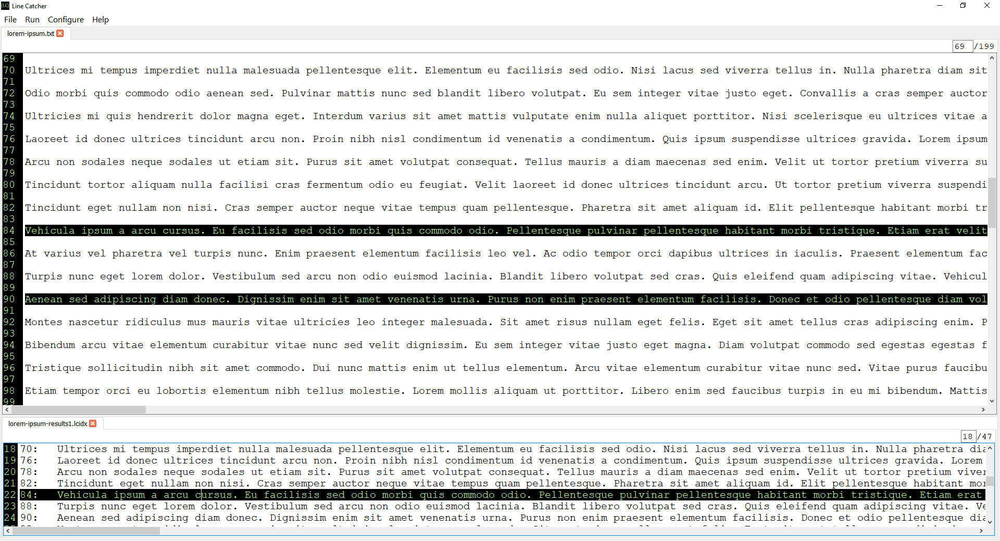
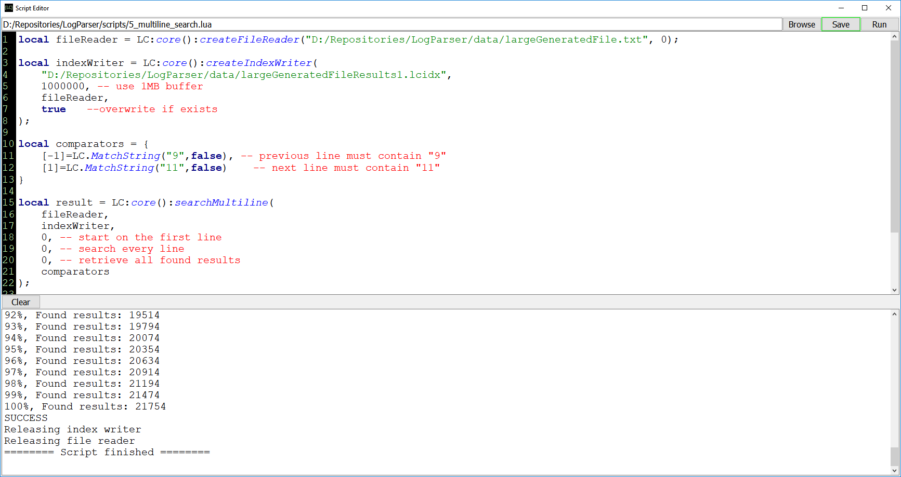

<h1>Line Catcher</h1>

Line Catcher (LC) is an advanced programmable log parsing tool aimed to simplify
    and save time on viewing, searching, and parsing large text files.

    

<table>
    <tr>
        <td></td>
        <td></td>
    </tr>
</table>

    

<table>
    <tr>
        <th>Issues with large files</th>
        <th>How we solve them</th>
    </tr>
    <tr>
        <td>Large files are hard to open since they do not fit into memory</td>
        <td>LC keeps only the required part of the file in memory while still allowing 
            fast navigation using indexes. Indexes are generated the first time file is opened.</td>
    </tr>
    <tr>
        <td>Searches are time-consuming. For example, searches on a file of 50GB can take over 30 mins; 
            tweaking search parameters would mean re-running this lengthy process many times.</td>
        <td>LC is optimized for fast file processing. While there are limits to how fast a file 
            can be read since we are bound by disk read speeds, we can search smarter by limiting 
            the amount of lines to process. LC offers a number of tools to limit search area including 
            reusing previous search results. As an example, you can first run a general search to note 
            points of interest (generate an index), then run a more detailed search that narrows down 
            results from the previous search. As a result, the next search can be significantly faster 
            than the first.</td>
    </tr>
    <tr>
        <td>There are too many results. Searching a large file can produce thousands of results,
            most of them may be irrelevant.</td>
        <td>LC allows defining very specific search criteria to retrieve only relevant results. 
            Multi-line search enables using information from adjacent lines to include more context 
            in the search.</td>
    </tr>
    <tr>
        <td>Extracting information is challenging and often requires custom parsing scripts/applications.</td>
        <td>LC contains an embedded Lua scripting engine allowing you to write a custom parser and output 
            data in any format. </td>
    </tr>
</table>

<h2>Application features</h2>

The LC version 0.9 beta provides the following functionality:

<ul>
    <li>Opening and viewing large files;</li>
    <li>Supported files encoded with ASCII and UTF-8</li>
    <li>Instant random access to any portion of a file using line navigator;</li>
    <li>Regular search and advanced multi-line search functionality;</li>
    <li>Multiple options for limiting the search area, including the reuse of previous search results;</li>
    <li>Script Editor for creating and running custom parsing scripts;</li>
    <li>Font size adjustment settings</li>
</ul>

<h2>System Requirements</h2>
<ul>
    <li>OS: Windows 64 bit</li>
    <li>Memory: Minimum 1GB</li>
</ul>
